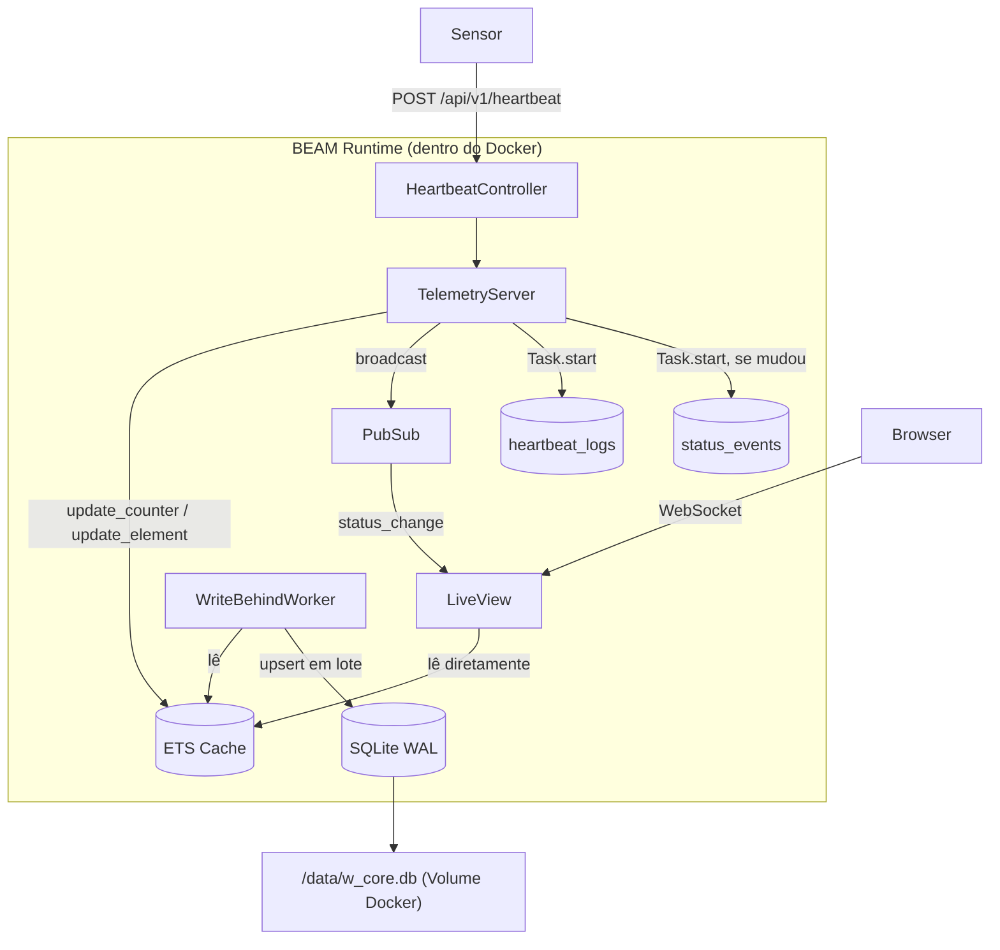

# Step 5 — Docker e deploy: a parte que eu já conhecia

## O que eu fiz

Esse passo foi um passo confortável pra mim. Trabalho com Docker faz tempos — o High Tide Systems roda em containers numa VPS com Docker Compose, e eu cuido do CI/CD. Então a parte de Dockerfile multi-stage, volumes e healthcheck foi território familiar.

O que era novo: entender como funciona uma `mix release` e como a BEAM se comporta num container.

Criei:
- `Dockerfile` multi-stage (builder + runtime Alpine mínimo)
- `docker-compose.yml` com volume persistente pro SQLite
- `rel/overlays/bin/entrypoint.sh` — roda migrações antes de iniciar
- `rel/env.sh.eex` — flags da VM do Erlang pra produção
- `lib/w_core/release.ex` — task de migração pra dentro da release
- `GET /health` — endpoint de healthcheck

## O Dockerfile (a parte familiar)

A estrutura multi-stage eu já uso nos meus projetos Node: um estágio pesado pra compilar e um mínimo pra rodar. O conceito é idêntico:

```dockerfile
# Node — o que eu faria
FROM node:20-alpine AS builder
COPY package*.json ./
RUN npm ci
COPY . .
RUN npm run build

FROM node:20-alpine
COPY --from=builder /app/dist ./dist
```

```dockerfile
# Elixir — o equivalente
FROM hexpm/elixir:1.19.2-erlang-28.3.1-alpine-3.21.3 AS builder
COPY mix.exs mix.lock ./
RUN mix deps.get --only prod && mix deps.compile
COPY lib lib assets priv rel ./
RUN mix assets.deploy && mix release

FROM alpine:3.21.3
COPY --from=builder /app/_build/prod/rel/w_core ./
```

A diferença interessante: no Elixir, a imagem final não precisa ter o Elixir instalado. O `mix release` gera um binário auto-contido com a VM da BEAM embutida. É como se o `npm run build` gerasse um executável standalone em vez de precisar do Node pra rodar. A imagem final fica em torno de 70-90MB, comparado com ~500MB se eu deixasse o Elixir completo.

O truque de separar `COPY mix.exs mix.lock` do `COPY lib lib` eu já fazia com `package.json` — assim o Docker aproveita o cache quando só o código muda, sem reinstalar dependências do zero.

## Volume SQLite

```yaml
volumes:
  - sqlite_data:/data
```

Usei volume nomeado em vez de bind mount (`./data:/data`). Bind mount expõe o path do host e é frágil entre máquinas — já tive problema com isso em CI onde os paths eram diferentes. Volume nomeado é gerenciado pelo Docker e funciona em qualquer ambiente.

Quando o container reinicia:
1. O volume `sqlite_data` continua existindo (`docker compose down` sem `--volumes` não apaga)
2. O entrypoint roda as migrações (são idempotentes — se já rodaram, não fazem nada)
3. O SQLite é montado no mesmo caminho `/data/w_core.db` — dados intactos

## O que era novo: flags da VM do Erlang

Isso não tem paralelo direto no Node. O `rel/env.sh.eex` configura parâmetros internos da BEAM:

```sh
export ERL_FLAGS="+P 1000000 +Q 65536"
```

- `+P 1_000_000` — número máximo de processos Erlang (o padrão é ~262k). O teste de 10k eventos cria uma Task por evento — cada Task é um processo. Sem aumentar esse limite, a VM recusaria criar novos processos em cenários de carga pesada.
- `+Q 65_536` — máximo de ports (conexões TCP, arquivos abertos).
- `RELEASE_DISTRIBUTION=none` — desabilita o modo distribuído. A aplicação roda em instância única (edge, na usina), não precisa de comunicação entre nós Erlang.

O Node tem `--max-old-space-size` pra limitar memória heap, mas não tem esse nível de controle sobre processos internos. É uma das coisas que a BEAM oferece por ser uma VM completa com scheduler próprio.

## Diagrama da arquitetura final



E o fluxo dentro do container:

```
+------------------------------------------------------------------+
|                        Docker Container                           |
|                                                                   |
|  +--------------+    +--------------------------------------+     |
|  |  Entrypoint  |    |          BEAM Runtime (OTP 28)       |     |
|  |  sh script   |    |                                      |     |
|  |              |--->|  WCore.Application (Supervisor)      |     |
|  |  1. migrate  |    |     |                                |     |
|  |  2. start    |    |     +- WCore.Repo (SQLite/Ecto)      |     |
|  +--------------+    |     +- Phoenix.PubSub                |     |
|                      |     +- WCore.Telemetry.Supervisor    |     |
|                      |     |    +- TelemetryServer (ETS)    |     |
|                      |     |    +- WriteBehindWorker        |     |
|                      |     +- WCoreWeb.Endpoint (Bandit)    |     |
|                      |                                      |     |
|                      +------------------+-------------------+     |
|                                         |                         |
|  +--------------------------------------v--------------------+    |
|  |  Sensor POST --> Controller --> TelemetryServer           |    |
|  |                                       |                   |    |
|  |                        ETS Cache <----+                   |    |
|  |                             |                             |    |
|  |                   WriteBehindWorker (5s / 500 eventos)    |    |
|  |                             |                             |    |
|  |                             v                             |    |
|  |                   +------------------+                    |    |
|  |                   |  /data/w_core.db |  <--- VOLUME       |    |
|  |                   |   (SQLite WAL)   |                    |    |
|  |                   +------------------+                    |    |
|  +-----------------------------------------------------------+    |
+------------------------------------------------------------------+
           |                    |
           | :4000              | :4000
           v                    v
     Browser/LiveView      Sensors (API)
```

## Como testar

```bash
# 1. Copiar variáveis de ambiente
cp .env.example .env
# Editar .env com SECRET_KEY_BASE e API_KEY

# 2. Build e start
docker compose up -d

# 3. Verificar se subiu
curl http://localhost:4000/health
# {"status":"ok","ets":true,"timestamp":"..."}

# 4. Mandar um heartbeat
curl -X POST http://localhost:4000/api/v1/heartbeat \
  -H "Authorization: Bearer $API_KEY" \
  -H "Content-Type: application/json" \
  -d '{"machine_identifier":"sensor-prod-1","status":"online","payload":{"temp":38}}'

# 5. Reiniciar e ver se os dados sobreviveram
docker compose restart
sleep 5
curl http://localhost:4000/health
# ETS vazio (acabou de reiniciar), mas o SQLite preservou tudo
# O TelemetryServer faz warm-up do ETS a partir do SQLite na inicialização
```
